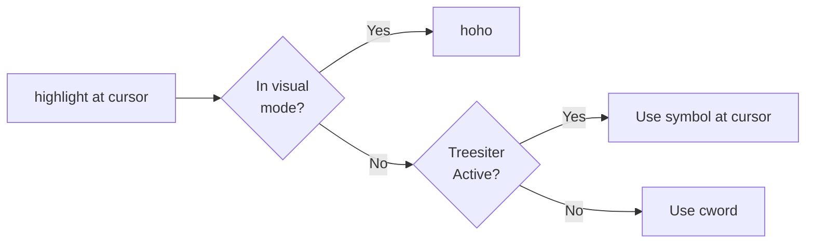

# confetti

Highlight lots of words like it's a party

# Dev

`<leader>uI`
`<leader>ui`
:EditQuery
:help compl-omni)

# Installation

## lazy.nvim
```lua
return {
  {
    "imochoa/confetti.nvim",
    -- lazy = true,
    cmd = { "RereCmd", "Quickfail" },
    opts = {
      reused_hlgroups = {},
      colors = {},
    },
    keys = {
      { "<leader>*", "", desc = "+Confetti!", mode = { "n", "v" } },
      {
        "<leader>**",
        function()
          -- vim.print("called!")
          -- vim.print(vim.rtpath)
          -- vim.print(vim.rtpath)
          require("confetti").highlight_at_cursor()
        end,
        mode = { "n", "v" },
        desc = "confetti highlight at cursor",
      },
      {
        "<leader>*d",
        function()
          require("confetti").clear_highlights()
        end,
        desc = "clear confetti highlights",
      },
    },
  },
{
    "folke/which-key.nvim",
    optional = true,
    opts = {
      spec = {
        { "<leader>*", group = "confetti" ,icon = "🎉"},
      },
    },
  }
}

```
## Using LazyVim


```lua
-- ~/.config/nvim/lua/plugins/confetti.lua
return {
 {
  "imochoa/confetti",
  opts = {
   reused_hlgroups = {},
   colors = {
    {
     guifg = "black",
     guibg = "white",
     altfont = false,
     bold = false,
     inverse = false, -- Inverse will flip fg and bg
     italic = false,
     nocombine = false,
     standout = false,
     strikethrough = false,
     undercurl = false,
     underdashed = false,
     underdotted = false,
     underdouble = false,
     underline = false,
    },
    { guifg = "black", guibg = "magenta", altfont = true },
    { guifg = "black", guibg = "lime", bold = true },
    { guifg = "black", guibg = "yellow", italic = true },
    { guifg = "black", guibg = "red", nocombine = true },
    { guifg = "black", guibg = "darkviolet", standout = true },
    { guifg = "black", guibg = "chocolate", strikethrough = true },
    { guifg = "black", guibg = "thistle", undercurl = true },
    { guifg = "black", guibg = "orangered", underdashed = true },
    { guifg = "black", guibg = "greenyellow", underdotted = true },
    { guifg = "black", guibg = "acqua", underdouble = true },
    { guifg = "black", guibg = "hotpink", underline = true },
   },
  },
  keys = {
   {
    "<leader>*",
    function()
     require("confetti").highlight_at_cursor()
    end,
    desc = "Highlight at cursor",
   },
   {
    "<leader>**",
    function()
     require("confetti").clear_highlights()
    end,
    desc = "Clear all confetti highlights",
   },
  },
 },
}
```

## Logic



# Development

## Prerequisites

- Neovim (stable or nightly)
- Lua/LuaJIT
- [Luarocks](https://luarocks.org/) (for luacheck)
- [Cargo](https://doc.rust-lang.org/cargo/getting-started/installation.html) (for stylua)

## Setup

Install development tools:

```bash
just install-tools
```

This will install:

- **luacheck** - Lua linter
- **stylua** - Lua formatter

## Local Development Setup

To work on the plugin locally and test your changes:

### 1. Clone the repository

```bash
git clone https://github.com/imochoa/confetti.git ~/code/confetti
cd ~/code/confetti
```

### 2. Configure Neovim to use your local copy

Update your Neovim configuration to point to your local clone instead of the GitHub repository.

#### Using lazy.nvim

```lua
-- ~/.config/nvim/lua/plugins/confetti.lua
return {
 {
  -- Use local directory instead of GitHub
  dir = "~/code/confetti",
  opts = {
   -- Your configuration here
  },
  keys = {
   {
    "<leader>*",
    function()
     require("confetti").highlight_at_cursor()
    end,
    desc = "Highlight at cursor",
   },
   {
    "<leader>**",
    function()
     require("confetti").clear_highlights()
    end,
    desc = "Clear all confetti highlights",
   },
  },
 },
}
```

#### Using packer.nvim

```lua
use {
 "~/code/confetti",
 config = function()
  require("confetti").setup({
   -- Your configuration here
  })
 end
}
```

### 3. Reload the plugin during development

The plugin includes a reload function for development. Add a keybinding to quickly reload changes:

```lua
vim.keymap.set("n", "<leader>cr", function()
 require("confetti").reload()
end, { desc = "Reload confetti plugin" })
```

Now you can:

1. Make changes to the plugin code
2. Press `<leader>cr` to reload the plugin
3. Test your changes immediately without restarting Neovim

```lua
vim.keymap.set("n", "<space><space>x", "<cmd>source %<CR>")
vim.keymap.set("n", "<space>x", ":.lua<CR>")
vim.keymap.set("v", "<space>x", ":lua<CR>")
```

## Tools Configuration

- **StyLua**: Configured in `.stylua.toml` for consistent code formatting
- **Luacheck**: Configured in `.luacheckrc` for linting rules
- **EditorConfig**: Configured in `.editorconfig` for editor consistency
- **Testing**: Uses [plenary.nvim](https://github.com/nvim-lua/plenary.nvim) for testing framework

## CI/CD

GitHub Actions automatically runs on push and pull requests:

- Linting with luacheck
- Format checking with stylua
- Tests on Ubuntu and macOS with stable and nightly Neovim

See `.github/workflows/ci.yml` for details.

# Lua

## Annotations

<https://luals.github.io/wiki/annotations/>
